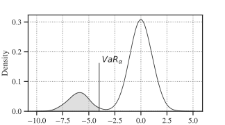
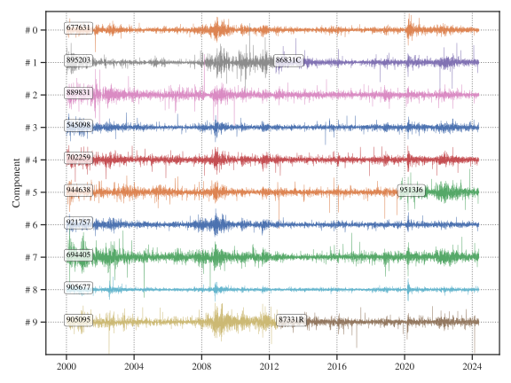
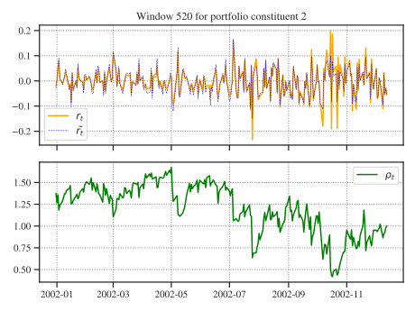
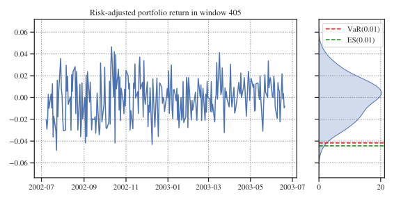
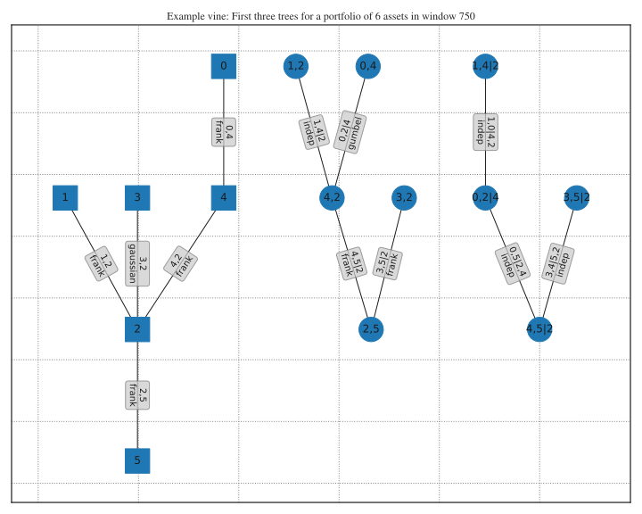
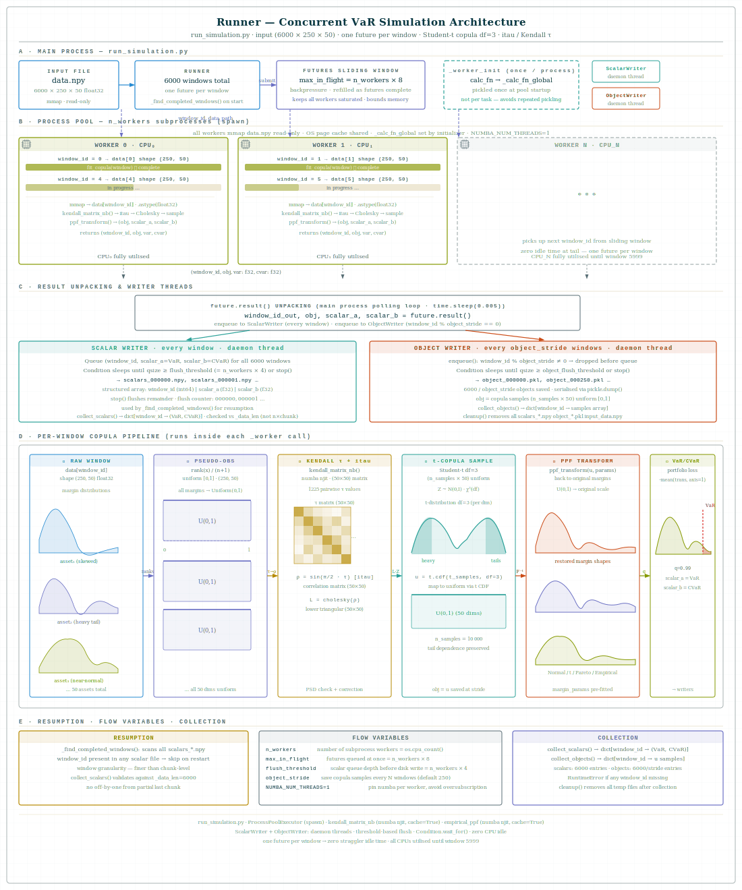

# A Dynamic Vine Copula Based Portfolio Value-at-Risk and Expected Shortfall analysis
This package offers several tools for the modelling, analysis and backtesting of portfolio value-at-risk (VaR) and expected shortfall (ES).

**Abstract** <br>
I evaluate the one-day ahead Value-at-Risk (VaR) and Expected Shortfall (ES) in high-dimensional portfolios using various models, including three benchmark models, Variance-Covariance, Historical Simulation and Multivariate Copula models, and Vine Copula based models.
To account for heteroskedasticity all models are applied to volatility-adjusted daily log-returns.
The Variance-Covariance model, while computationally efficient, assumes normality which may not hold for financial returns and Historical Simulation provides decent 
VaR estimates but struggles with extreme events out-of-sample.
Copula models on the other hand offer flexibility in capturing dependencies, with t-copula models showing superior performance in extreme market conditions but struggle in ultra-high dimensions. 
This package addresses these limitations by utilizing **Vine Copulas**, which allow for the flexible modelling of complex, non-linear dependencies in the tails of return distributions. By decomposing multivariate distributions into a hierarchy of bivariate copulas, we can more accurately capture "asymmetric tail dependence"—where assets exhibit stronger correlations during market crashes than during booms.
<br>
**Keywords**: Vine Copula, Portfolio, VaR, ES, GARCH

## 1 Introduction
In the realm of financial economics, understanding the complex interdependencies between multiple asset returns is crucial for effective portfolio management, risk assessment, and hedging (Mashal & Zeevi, 2002), to name just a few. Traditional methods for modelling asset return often rely on multivariate normal distributions, which cannot adequately capture the true nature of financial data, especially in the presence of extreme events and asymmetric relationships (see e.g. Embrechts et al., 2001). <br>
Furthermore, simple correlation is rather limited in displaying the actual underlying dependencies (Mashal & Zeevi, 2002). These limitations have driven researchers and practitioners to explore more flexible approaches that can better account for the inherent dependence structures among asset returns.
Copula functions have emerged as a powerful tool for modelling multivariate distributions by separating the modelling of marginal behavior from the modelling of dependence structures. This flexibility allows for a more accurate representation of the joint distribution of asset returns, accommodating non-linear dependencies and tail correlations that are often observed in financial markets.
A growing body of scientific literature supposes copula methods as elgant approaches for the estimation of (one-day ahead) market risk metrics.
The so-called market risk is of crucial concern for financial institutions hence it encompasses the potential for change in the value of a financial position due to fluctuations in the price of the underlying components (see McNeil et al., 2015). One of the most effective and widespread tools for quantifying market risk is the so-called Value-at-Risk (VaR), an estimate of the maximum potential loss over a given time frame associated with a specified confidence level (see Nadarjah & Chan in Longin, 2017). <br>
From a mathematical point of view this is a simple “quantile of the profit-and-loss (P&L) distribution of a given portfolio over a prescribed holding period” (McNeil & Frey, 2000).
Although its conceptual simplicity and ease of computation made VaR the usual financial risk measure, Artzner et al. (1999) indicate some major theoretical deficiencies
of the concept, first and foremost that it disregards any losses beyond the specified level $\alpha$, a circumstance referred to as ‘tail risk’ (see Yamai & Yoshiba, 2005).



**Figure 1**: A visual representation of the tail-risk associated with an $\alpha$-level VaR of an aribtrary distribution of portfolio returns.

A preferred *coherent* risk metric that tries to overcome these disadvantages, particularly considering extreme events (see Tasche 2002), is the so-called Expected Shortfall (ES), also known as conditional VaR (CVaR). The term describes the expected loss under the condition of a loss event, i.e. a return realization beyond the $\alpha$-level VaR (see Figure 1, grey). For a random variable $X$, i.e. daily portfolio returns, we denote,

```math
ES_{\alpha} = E[X|X \lt VaR_{\alpha}]
```

Finally, VaR and ES are backtestet using several statistical tests.
This study is organized in several modules: The `models` module contains classes and functions for the different resolution methods, e.g. *Historical Simulation*, *t-Copula Simulation*, etc., the module `backtests` implements different statistical tests for backtesting VaR and ES, and the module `tools` contains frequently used helper functions.

A complete risk model requires at least the following steps:
1. Portfolio Construction
2. Choosing a Volatility Model
3. Risk-adjustment of Returns
4. VaR & ES Calculation
5. Backtesting

> [!NOTE]
> Every step offers several classes and/or command-line tools.

## 1. Portfolio Construction
The starting point for each model is a specific portfolio, e.g. a portfolio with 20 assets. Financial time-series often suffer from missing data due to staggered listings, de-listings, or holidays. To maintain a constant portfolio dimension over time, we employ **Hot-Deck Imputation**. This technique involves replacing missing values (receivers) with observed values from comparable series (donors).

### Imputation Strategies
I offer several strategies to construct a fully populated portfolio out of a set of incomplete asset return series:
- **`RandomImputation`**: Imputes individual time-series with randomly chosen donor series.
- **`MaximumCoverageImputation`**: Recursively replaces a receiver with a donor that provides the maximum coverage on the receiver's missing days. This maximizes the utilization of real market data.
- **`MaximumCorrelationImputation`**: Completes the receiver with a donor series exhibiting the highest pair-wise correlation (Spearman's $\rho$, Kendall's $\tau$, or Pearson's $r$). This ensures the imputed data maintains the statistical properties of the original series.
- **`MaximumSimilarityImputation`**: Completes each receiver with the donor series that scores the highest similarity metric, such as Dynamic Time Warping (DTW) or Euclidean Distance.

> [!NOTE]
> Each imputation strategy can be initiated with a set of series which must be in the portfolio, e.g. the current Nasdaq 100 constituents.

```python
import pandas as pd
from tools.Imputation import MaximumCoverageImputation

# Load daily returns
returns = pd.read_parquet(...)

# Set portfolio initialization, titles that must be in the portfolio in its full extent
init = ["NVDA","MSFT","AAPL"]

# Set portfolio dimension
N = 20

# Instantiate the imputer
imputer = MaximumCoverageImputation(returns, tickers=init, n=N)

# Tuple of the daily portfolio composition and return
df_p, df_r = imputer.impute()
```
Figure 2 shows an example of a fully populated portfolio of ten risk factors constructed with a maximum coverage strategy and initialized with ten randomly chosen Nasdaq 100 constituents.



**Figure 2**: A fully populated portfolio ten risk factors.

## 2. Choosing a Volatility Model
To adjust the log-returns to the current level of volatility, one must choose a volatility model. Financial returns are famously characterized by "volatility clustering"—periods of high volatility followed by periods of relative calm. We model this using the GARCH family of processes.

### 2.1 Volatility Process
All models assume a constant mean $\mu$. The conditional variance $\sigma_t^2$ is modelled as follows:

**GARCH(1,1)**: A symmetrical process where persistence is captured by past squared residuals and past variance.

```math
\sigma_t^2 = \omega + \alpha \epsilon_{t-1}^2 + \beta \sigma_{t-1}^2
```

**GJR-GARCH(1,1,1)**: An asymmetrical process that accounts for the "leverage effect" (negative shocks often increase volatility more than positive shocks).

```math
\sigma_t^2 = \omega + (\alpha + \gamma I_{t-1}) \epsilon_{t-1}^2 + \beta \sigma_{t-1}^2
```
where $I_{t-1} = 1$ if $\epsilon_{t-1} < 0$, and 0 otherwise.

**EGARCH(1,1,1)**: An exponential model that ensures positive variance and captures asymmetric impacts in log-space.

```math
\ln(\sigma_t^2) = \omega + \alpha | \frac{\epsilon_{t-1}}{\sigma_{t-1}} - E[|\frac{\epsilon_{t-1}}{\sigma_{t-1}}|] | + \gamma \frac{\epsilon_{t-1}}{\sigma_{t-1}} + \beta \ln(\sigma_{t-1}^2)
```

**EWMA**: Exponentially Weighted Moving Average, a common industry standard (RiskMetrics).

```math
\sigma_t^2 = \lambda \sigma_{t-1}^2 + (1-\lambda) \epsilon_{t-1}^2
```

### 2.2 Innovation Distribution
Every volatility process is paired with an assumption about the distribution of the innovations $z_t = \epsilon_t / \sigma_t$:
- **Normal**: Standard Gaussian assumption.
- **Student's t**: Captures excess kurtosis (fat tails) in the residuals.
- **Empirical**: Uses a non-parametric approach (KDE or histogram) to model the distribution, allowing for arbitrary shapes.
- **Generalized Error (GED)**: A flexible family that includes normal and Laplace distributions.

### 2.3 Resolution Order & Convergence
Fitting GARCH models can be numerically unstable. Our implementation in `models/Volatility.py` uses a **Resolution Order** to ensure robustness:
1. Attempt to fit the primary model (e.g., GJR-GARCH).
2. If convergence fails, fallback to a simpler model (e.g., GARCH(1,1)).
3. If still unsuccessful, fallback to the highly robust **EWMA** with $\lambda=0.94$.

To create the volatility forecasts, run

```batch
cp scripts/run_volatility_forecasts.py .
python run_volatility_forecasts.py -p 20 -vm Garch -id Empirical
```
... for all options see `python run_volatility_forecasts.py --help`.

This will store batch-wise calculated risk forecasts and model summaries in `/temp`. These must be aggregated seperately with

```batch
cp scripts/build_volatility_data.py .
python build_volatility_data.py
```

> [!IMPORTANT] 
> This will save the aggregated files, e.g. `volatility_forecasts.parquet`, into `data/20/Garch/Empirical/`. Make sure to create the folder(s) first!

## 3. Adjusted Returns
Standard risk models often assume that price returns are independent and identically distributed (i.i.d.). However, in reality, volatility varies over time. To use copula models effectively, we must first "de-volatize" the returns and then "re-volatize" them to the current regime.

The one day-ahead VaR and ES forecasts are calculated in a rolling window manner based on **Adjusted Returns**. For each window $[t, T]$, the returns $r_t$ are adjusted to the forecast volatility $\sigma_T$ using the ratio:

```math
\tilde{r_t} = \frac{\sigma_T}{\sigma_t} \cdot r_t
```

This transformation (found in `models/AdjustedReturn.py`) ensures that the historical data used for copula fitting is representative of the current market volatility environment.

```python
import pandas as pd
from models.AdjustedReturn import adjusted_return_windows

returns = pd.read_parquet("data/20/portfolio_returns.parquet")
volatilities = pd.read_parquet("data/20/Garch/Normal/volatility_forecasts.parquet")

adj_returns = adjusted_return_windows(returns, volatilities)
```

Figure 3 investigates the adjusted ($\tilde{r_t}$) and unscaled returns $r_t$ and the adjustment factor $\rho_t$ for an arbitrary window and asset.



**Figure 3**: Adjusted vs. un-adjusted return and adjustement factor for an arbitrary window and asset.

> [!NOTE]
> Due to the nature of the adjustment process the last adjustement facor in each window evaluates to one.

## 4. Value at Risk (VaR) & Expected Shortfall (ES)
This package calculates one-day ahead risk forecasts using adjusted returns. We focus on two primary risk measures:

### 4.1 Mathematical Definitions
**Value at Risk (VaR)**: The maximum potential loss over a given time horizon at a specific confidence level $(1-\alpha)$.

```math
VaR_\alpha(X) = \inf \{ x \in \mathbb{R} : P(X + x < 0) \leq \alpha \}
```

**Expected Shortfall (ES)**: Also known as Conditional VaR (CVaR), it measures the average loss given that the loss exceeds the VaR level.

```math
ES_\alpha(X) = E[X | X < -VaR_\alpha(X)]
```
The risk estimation is conducted in a rolling window manner using adjusted returns, in other words, the next-day risk measure is forecasted based on the previous 250 (adjusted) portfolio returns.

### 4.2 Coherent Risk Measures
According to Artzner et al. (1999), a risk measure is **coherent** if it satisfies four properties: Monotonicity, Subadditivity, Homogeneity, and Translational Invariance. While VaR is widely used, it is **not coherent** because it fails the subadditivity test. **ES is a coherent risk measure**, making it a superior choice for tail risk management.

### 4.3 Implemented Models
#### 4.3.1 Historical Simulation (HS) 
A non-parametric approach that uses historical returns as the distribution for future returns.
This benchmark model is a simple historical simulation approach where I estimate the day-ahead VaR as empirical quantile of the last 250 adjusted portfolio return observations in a rolling window manner for each window.
The natural estimator for the ES is simply given by the arithmetic mean of the worst 1% observations in each window.

Figure 4 shows the next-day risk estimate for an arbitrary window.



**Figure 4**: Simulation of the next-day risk estimates in an arbitrary window.

#### 4.3.2 Variance-Covariance (VC) 
Assumes returns follow a multivariate normal distribution.
The linear-parametric variance-covariance model, called *1.c*, assumes that asset returns are multivariate normally distributed and is built upon the assumption of constant portfolio standard deviation. <br>
The day-ahead VaR expressed as a simple $\alpha$-quantile of portfolio return observations $Q_\alpha$ is given by,

```math
Q_{\alpha,t+1} = \mu_{pf,t} +\sigma_{pf,t} \Phi^{-1}(\alpha) 
```

where $\mu_{pf,t}$ and $\sigma_{pf,t}$ are the day-*t* expected portfolio return and standard deviation, and $\Phi^{-1}(\alpha)$ is the standard normal $\alpha$-quantile.

For the next-day ES, expressed as the expected return below the $\alpha$-quantile $ETR_\alpha$, I denote,

```math
ETR_{\alpha,t+1} =\frac{1}{\alpha} \int_{-\infty}^{Q_{\alpha,t+1}} x f(x)dx
```

#### 4.3.3 Multivariate Copula
Uses multivariate copulas to model the dependence structure between assets. The copula is fitted with pseudo-observations and, once calibrated, is used to draw 100,000 uniformly distributed random samples that implicitly represent the dependence structure. These samples are extended by their antithetic variates to further reduce variance and re-transformed to the "original" margin scale. Finally, the VaR and ES are given by the alpha-quantile of the portfolio returns of the re-transformed univariate time-series.

#### 4.3.4 Vine Copula 
The flagship model. It decomposes the $N$-dimensional multivariate distribution into $N(N-1)/2$ bivariate "pair-copulas".
The simulation process is the same as for the multivariate copula.

Figure 5 shows an example of the vin structure in an arbitraray window. It contains the first three trees in a portfolio of six assets.



**Figure 5**: First three trees of the vine in an arbitrary window for a six-dimensional portfolio.

### 4.4 Running the Risk Forecasts
To create a risk forecast, use the scripts in the `scripts/` folder. For a Vine Copula simulation:

```bash
cp scripts/run_vine_copula.py .
python run_vine_copula.py -p 20 -vm Garch -id Empirical -md Empirical
```

**Common Arguments:**
- `-p`, `--portfolio`: Portfolio size.
- `-vm`, `--volatility_model`: (`Garch`, `Egarch`, `GJR`).
- `-id`, `--innovation_distribution`: (`Normal`, `StudentsT`, `Empirical`, `GeneralizedError`).
- `-md`, `--margin_distribution`: Margin distribution for copula transformation.
- `--alpha`: Confidence level (default: 0.01).
- ...

For all available options see:
```bash
python scripts/run_vine_copula.py --help
```

> [!TIP]
> This will write VaR & ES forecasts and model summaries directly into the simulation folder once its completed. Temporary results are kept in a the `temp/` directory.

**Concurrent Implementation & Cloud Scalability**
The risk forecasts (multivariate copula & vine copula) are calculated concurrently in `tools.Runner` using a `ProcessPoolExecutor`. This architecture is designed for massive, window-based computations.



**Cloud-Ready Features**
- **Parallelism**: Efficiently utilizes all available CPU cores.
- **Resumability**: The `Runner` class uses a `ScalarWriter` and `ObjectWriter` to save results window-by-window. If a calculation is interrupted, it can is  auto-resumed from the last checkpoint.
- **Spot Instance Friendly**: This resumable nature makes it ideal for **Cloud Compute Spot Instances** (e.g., AWS Spot, Google Preemptible VMs). You can save significantly on compute costs without the risk of losing days of progress if an instance is reclaimed.

All completed simulation paths can be inspected via

```bash
source .bashrc
show_complete_simulations
```

## 5. Model Analysis & Backtesting
A risk model is only as good as its performance in the real world. I provide a suite of statistical tests in the `backtest` module to validate our VaR and ES forecasts.

### 5.1 VaR Backtests
- **Kupiec Test (1995)**: An unconditional coverage test that verifies if the total number of violations is consistent with the theoretical $\alpha$ level.
- **Christoffersen Test (1998)**: A conditional coverage test that evaluates whether violations are independent. A good model should not exhibit "volatility clusters" where one violation is followed by another.
- **Duration Test (Christoffersen & Pelletier, 2004)**: Examines the time between violations. Under the null hypothesis of a correctly specified model, these durations should be memoryless (follow an exponential distribution).

### 5.2 ES Backtest
- **McNeil and Frey Test (2000)**: Since Expected Shortfall is a conditional mean, we test the "excess shortfall" (the difference between actual loss and the ES forecast on violation days). We use a bootstrap-based t-test to check if the mean of these exceedances is zero.

### 5.3 Visualization Tools
The `tools` module offers several analysis tools:
- **`tools.Graphs`**: Network visualization and inspection of Vine Copula structures.
- **`tools.Plotting`**: Comprehensive plotting utilities for returns, volatility, and risk metrics.

## 6 References
Artzner, P., Delbaen, F., Eber, J.M., Heath, D. (1999). Coherent Measures of Risk, Mathematical Finance, 9(3), pp. 203–228.

Christofferson P.F. (1998). Evaluating Interval Forecasts, International Economic Review, 39(4), pp. 841-862.

Embrechts, P., Lindskog, F., McNeil, A.J. (2001). Modelling dependence with copulas, Rapport technique 14, Département de mathématiques, Institut Fédéral de Technologie de Zurich, pp. 1-50. 

Kupiec, P.H. (1995). Techniques for verifying the accuracy of risk measurement models, The Journal of Derivatives 3(2), pp. 73-84.

Mashal, R., Zeevi, A. (2002). Beyond Correlation: Extreme Co-Movements be-tween Financial Assets, Working paper. Available at SSRN: https://ssrn.com/abstract=317122 

McNeil, A.J., Frey, R. (2000). Estimation of Tail-Related Risk Measures for Heter-oscedastic Financial Time Series: An Extreme Value Approach, Journal of Empiri-cal Finance, 7(3-4), pp. 271-300.

McNeil, A.J., Frey, R., Embrechts, P. (2015). Quantitative Risk Management. Concepts, Techniques and Tools, Revised edition, Princeton University Press, Prince-ton and Oxford.

Nadarajah, S., Chan, S. (2017). Estimation Methods for Value at Risk. In: Longin, F. (eds.). Extreme Events in Finance: A Handbook of Extreme Value Theory and its Applications, John Wiley & Sons, New Jersey.

Tasche, D. (2002). Expected shortfall and beyond. Journal of Banking & Finance, 26, pp. 1519–1533.

Yamai, Y., Yoshiba, T., (2005). Value-at-risk versus expected shortfall: A practical perspective, Journal of Banking & Finance 29, pp. 997–1015.